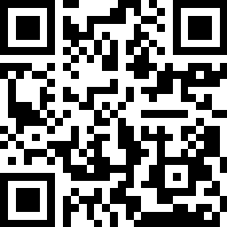

# PS4 PKG Installer
PS4 PKG Installer is a user friendly interface to upload pkg on your PS4.

## Prerequisites
Make sure you have installed all of the following prerequisites on your computer:
* Git - [Download & Install Git](https://git-scm.com/downloads). OSX and Linux machines typically have this already installed.
* Node.js - [Download & Install Node.js](https://nodejs.org/en/download/) and the npm package manager. If you encounter any problems, you can also use this [GitHub Gist](https://gist.github.com/isaacs/579814) to install Node.js.

## Cloning The GitHub Repository
The recommended way to get **PS4 PKG Installer** is to use git to directly clone the repository:
```bash
$ git clone https://github.com/derrix/ps4-pkg-installer
```

## Downloading The Repository Zip File
Another way to use the **PS4 PKG Installer** is to download a zip copy from the [master branch on GitHub](https://github.com/derrix/ps4-pkg-installer/master.zip). You can also do this using the `wget` command:

```bash
$ wget https://github.com/derrix/ps4-pkg-installer/master.zip -O PS4-client-PKG-installer.zip; unzip PS4-client-PKG-installer.zip; rm PS4-client-PKG-installer.zip
```

## Quick Install
Once you've downloaded/cloned the **PS4 PKG Installer** and installed all the prerequisites, you're just a few steps away from starting to using the application.
To install the dependencies, run this in the application folder from the command-line:
```bash
$ npm install
```

## Running Your Application
Run your application using npm:

```bash
$ npm start
```
Your application should run on port 3000 with, so in your browser just go to [http://127.0.0.1:3000](http://127.0.0.1:3000)
 

## Configure Your Application
On the sidebar you can configure all setting to upload you pkgs file on your PS4.
* PS4 IP Address: insert your LAN PS4 ip address;
* Server IP Address: select your IP address according to PS4 subnet;
* PKG Folder Path: insert full path of your PS4 pkg folder;

## Install PKG
You must install on your PS4 [ps4_remote_pkg_installer](https://github.com/flatz/ps4_remote_pkg_installer) and open it. Now if settings are fine you can press install and enjoy it!


## Help
If you want to buy me a beer or a coffe, you are very welcome to send me Bitcoins to Address `15FieJMjYPiVgE4Kt9ALDP9skMw3BFcE98`


 Thanks :-)
